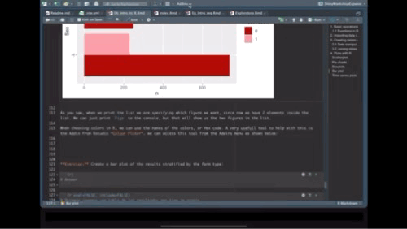

____________________________________________________________________

# Basic operations
R is like a calculator, we can make mathematical operations, for example:

```{r}
2 + 2
```

R is a object-oriented programming language, this means that we create objects that contain information. In R you can achieve the same results using different approaches, for example, to create an object we just type a name for the object and assign it a value using the operators `=` or `<-`. We can make operations with objects of the same type, for example:

```{r}
x = 2 # create a new object with the = operator
y <- 2 # create a new object with the <- operator
x + y # make a operation with the objects
```

You can store more than one value using vectors, to create a vector of numbers we use `c()`.
For example, we will store a sequence of numbers from 5 to 10 using 2 different approaches and then ask R if the objects are the same.  
**tip:** using the keys "alt" + "-" will automatically add the operator `<-`. Choosing which assign operator to use is a matter of preference, I personally think that is easier reading code with the operator `<-`, but a lot of people uses `=`.  

```{r}
x <- c(5, 6, 7, 8, 9, 10) # create a sequence form 5 to 10
y = 5:10 # create the same sequence but with a different approach
x == y # ask R if the objects have the same information
```

When we have a vector, we can ask R specific values inside an object.

```{r}
# Here we ask the 3rd value from our sequence
x[3]
# Now we multiply the 3rd value of the x sequence times the 5th value of the y sequence
x[3] * y[5]
```

## Functions in R

R has a lot of base functions, but we can define new functions. When using R studio, the key *Tab* will help us to auto complete, this can help us a lot when we don't remember the exact name of the functions available.
The best part of programming with R is that it has a very active community. Since its open source, anyone can create functions and compile them in a package (or library). we can download these packages and access new functions.  
Functions in R require arguments, which we can see in the function documentation or if we press the key *Tab* when we are inside the function.  

```{r}
# To get the sum of a vector of numbers inside an object we use sum()
sum(x)
```

We can put functions inside function, for example, to get $\sqrt{\sum_1^n x}$ the square root of a sum of the numbers in x we can use:

```{r}
sqrt(sum(x))
```

Making functions in R is not as complicated as it sounds and can be very useful when we need to do repetitive work. To define a function we need to include the arguments that we want for the function and what are we doing with those arguments. For example, the following function has only one argument which is a name (string) and just pastes some text before and after:

```{r}
F1 <- function(name){
  x <- paste("Hola", name, "! welcome to the R world!") # paste the name with some text
  print(x)
}
# trying the function (Put your name)
F1(name = "Pablo")
```


Besides storing numbers in the objects in R, we can store text, matrices, tables, spatial objects, images, and other types of objects. Next we will import our own data and do some manipulation in R.

____________________________________________________________________

# Importing data into R

R can import data in different formats. The most common are excel files (*.csv*, *.xls* y *.xlsx*), text files *.txt* and spatial data *.shp*, which we will talk about more in detail later.  
To read *.xls*, *.xlsx* and *.shp* files we will need to install some libraries. To install a new library you need to be connected to the internet and use the function `install.packages()` to install the library. Once it has been installed, you can load the library using the function `library()`.  
  
Download the excel file from this [link](https://ucdavis.box.com/s/sllst2fftrincdu273mhqe3yt1krwenu). It's not necessary to have a Box account.  
  
**Suggestion:** Sometimes when we want to use only one function from a library, we can just write the name of the library followed by the operator `::` and the name of the function, for example: `package::function()`. This way we won't have to load the whole library.  

```{r}
# If we dont have the library installed, we use:
# install.packages("readxl")
library(readxl) # load the library

# Import the excel file
PRRS <- readxl::read_xlsx("Data/PRRS.xlsx")
```

The most popular format for tables in R are called `data.frame`, when we import the data from a *.csv* o *.xlsx*. We can examine what kind of object it is using the function `class()`, an object can have more than one type of class.  

```{r}
class(PRRS)
```

____________________________________________________________________

# Creating tables in R

We can use the base R functions to create basic tables. For example, we can create a table that shows the number of positive by sex:  

```{r}
TBL <- table(PRRS$Sex, PRRS$Result)
TBL
```

When we have a table object we can ask for a specific column or row, where is represented as [row, column].  

```{r}
TBL[,2] # Get the second column
```

## Data manipulation with dplyr

The library `dplyr` has several functions that can help to clean, create new variables, and modify our data in other ways.  

```{r message = F}
# if we dont have installed the library we will need to install it using:
# install.packages("dplyr")
# we load the library:
library(dplyr)
```

`dplyr` introduces a new operator called *pipes* (`%>%`), which can connect several functions to an object. This is an alternative to write several functions in a single "line of code" in a more organized way. For example, if we want to execute a function `F1()` followed by another function `F2()` for the object `x`:  

`F2(F1(x))` is equivalent to `x %>% F1() %>% F2()`    

As you can notice, to read the code `F2(F1(x))` we have to go from the inside to the outside to see the order of execution of the functions, but when we read `x %>% F1() %>% F2()` we read from left to right, which is the same way we normally would read any text.  


**Suggestion:** we can use the keys *Ctrl* + *shift* + *m* to insert the `%>%` operator.  

We will use this to calculate the prevalence by county:  

```{r}
PRRS %>% 
  group_by(County) %>% 
  summarise(N = n(), positive = sum(Result)) %>% 
  mutate(Prev = positive/N) %>% 
  arrange(desc(Prev))
```

Ok, so we used several functions connected to calculate the prevalence, so I will explain it by parts:  
  
  - First we put the name of our data.  
  - The first function `group_by()` will group the observations by one or more variables that we indicate.   
  - The function `summarise()` will execute a function we define for a variable from the defined grouping variable, e.g. when we write `n()` returns the number of observations per group and with `sum(resultado)` we are summing all the positive results by each county.    
  - The function `mutate()` will create a new variable, we use the variables *N* and *positive* created with the previous functions  and calculating the prevalence.  


**Exercise:** Now try to calculate the prevalence by farm type (variable *farm_type*):

```{r}
# Answer
PRRS %>% 
  group_by(farm_type) %>% 
  summarise(N = n(), positive = sum(Result)) %>% 
  mutate(Prev = positive/N) %>% 
  arrange(desc(Prev))
```

We can use any function with summarize, this is very useful because it allows to obtain quick statistics stratified by groups, for example, we can obtain the median, mean and variance by age and sex:  

```{r}
PRRS %>% 
  group_by(Sex) %>% 
  summarise(media_edad = mean(Age), mediana_edad = median(Age), SD_edad = sd(Age))
```


## Joining datasets:


```{r}
# Importing the farm dataseet
nodes <- read.csv("Data/node_attrib.csv")
# Importing the movement dataset
mov <- read.csv("Data/network.csv")
# Get the number of outgoing and incoming shipments 
Out <- mov %>% 
  group_by(id_orig) %>%
  summarise(Outgoing = n()) %>%
  rename(id = id_orig)
In <- mov %>%
  group_by(id_dest) %>%
  summarise(Incoming = n()) %>% 
  rename(id = id_dest)

# Joining the two datasets
nodes <- nodes %>% 
  left_join(Out, by ="id")

nodes <- nodes %>%
  left_join(In, by = "id")
nodes
```

Now we will get the ones that had the higher number of movements: 

```{r}
mov %>% 
  group_by(id_orig) %>% 
  summarise(N = n(), N_pigs = sum(pigs.moved)) %>%
  arrange(desc(N)) %>%
  head()
```
  
____________________________________________________________________
  
  
# Plots with R

The base plot in R includes several tools any kind of plots, some will be more straight forward than others. There are other libraries that has different functions (`ggplot2` is a very popular one), but you can achieve the same with base plots.

## Scatterplot.  
This is one of the most popular kind of plots, it is useful to represent relationship between two continuous variables.  
We can achieve the same result in different ways. The first one is better when we have our variables in the same dataset, and the second one when we have data from different objects. (the length of the two vectors has to be the same).  

```{r}
# When variables are from the same dataset
plot(Outgoing~Incoming, data = nodes)
# When variables from different dataset
plot(nodes$Outgoing, nodes$Incoming)
```

The same can be achieved with ggplot:

```{r}
# We load the library
library(ggplot2)

nodes %>% # first we start with the name of our data.frame
  ggplot() + # then we call ggplot
  geom_point(aes(Outgoing, Incoming)) # and we add the first layer, which is the points
```


## Pie charts

Pie charts are useful to show proportions, for example, next we will create a plot representing the proportion of positive animals for each type of farm.  
To select a variables from a data.frame we use `$`. For example if we want to see the variable farm type from our PRRS dataset, we use `PRRS$farm_type`.  

```{r}
# First we create a table for the result by farm type
TM <- table(PRRS$farm_type, PRRS$Result)
# Then we use the second column which contains the positive only
pie(TM[,2])
```

We can also store our plots objects in R and call them later, here we will start storing all our plots in a single list. One of the advantages of using lists is that you can organize your information in nested structures of different kinds of objects (i.e. dataframes, plots, other lists, etc...)  

Again, we can replicate this with ggplot. We just need to transform a little bit the data:

```{r}
# we create an empty list
Figs <- list()

Figs[['PieChart']] <- TM %>% # the data we are using
  data.frame() %>% # We convert it to a data.frame
  rename(group = Var1, Test = Var2) %>% # rename some of the variables
  filter(Test == 1) %>% # select only the positive cases
  ggplot() + # call ggplot
  geom_bar(aes(x = '', y = Freq, fill = group), stat = 'identity') + # to make a pie chart we start it as a bar chart
  coord_polar('y', start = 0) + # then we change the coordinates 
  theme_void() # we can add themes to change its appearance

# Now when we print our list we can obtain our plot
Figs
```

It's always nice to be familiarized with different methods to achieve the same result, as you can see, sometimes you can achieve a nice result with fewer lines of code using base R, but ggplot its more intuitive to understand (or at least to me). From now on we will focus on ggplot2 only.


## Boxplots  

Box plots are great to show the distribution of a continuous variable. We can use it to show only one variable, or multiple variables. It is important to be very descriptive when making plots, the idea of a figure is that can explain itselt. we will start to slowly introduce functions to do this and customize our figures.

```{r}
# Only one variable
PRRS %>% 
  ggplot() +
  geom_boxplot(aes(y = Age)) +
  labs(title = 'Distribution of Age') # we can add different labels such as the main title
```


```{r}
# Same variable, but stratified by another
Figs[['boxplot']] <- PRRS %>% 
  ggplot() +
  geom_boxplot(aes(y = Age, x = Sex), fill = 'lightgreen') +
  labs(title = "Boxplot of age stratified by sex")

# now that we have our figure stored in the list we can print it 
Figs$boxplot
```

As you saw, when we print the list we are specifying which figure we want, since now we have 2 elements inside the list. We can just print `Figs` to the console, but that will show us the two figures in the list.  

## Bar plot

For the next plot we will expand on the customization of the plots. First we will create a color palette, then we will transform our data to make a bar plot, then we will change the axis and add labels.

```{r }
# Create a new color palette:
colpal <- c("#C93434", "#5BA1F0", "#52C4A6")

# Make the plot
Figs[['BarPlot']] <- PRRS %>%  # the data we are using
  count(Result, Sex) %>%  # we will count the number of test results by sex
  ggplot() + # call ggplot
  geom_bar(aes(fill = factor(Result), x = Sex, y = n), # we want the fill color by test result, x axis by sex and y for number
           position = 'dodge', stat = 'identity') + # we define the position as dodge to have a side by side groups
  coord_flip() + # we change the coordinates
  scale_fill_manual(values = colpal) + # we specify the color palette we want
  labs(title = "Test results stratified by sex", fill = 'Test result') # we add labels

# Print our barplot
Figs$BarPlot
```

  
When choosing colors in R, we can use the names of the colors, or Hex code. A very usefull tool to help with this is the Addin from Rstudio *Colour Picker*. we can access this tool from the Addins menu as shown below:




**Exercise:** Create a bar plot of the results stratified by the farm type:  

```{r}
# Answer
```

```{r eval=FALSE, include=FALSE}
# First we create a table of the results by farm type
TM <- table(PRRS$Result, PRRS$farm_type)
# Next we use the function par() to increase the margins
par(mar = c(2, 6, 2, 2))
barplot(TM[, order(colSums(TM), decreasing = T)], beside = T, horiz = T, 
        las = 2, main = "Resultados por tipo de granja", col = colpal[1:2], 
        legend = rownames(TM))
```


## Time series plots.

To create a time series we will need to reformat the data a little bit so R can do what we want.  
```{r}
mov <- mov %>% 
  mutate(date = as.Date(date, "%m/%d/%y"), # First we will format the date
         week = format(date, "%V"),
         week = lubridate::floor_date(date, 'week')) # The we create a variable formatting the date as week of the year
```


```{r}
Figs[['TimeSeries']] <- mov %>% 
  count(week) %>% 
  ggplot() +
  geom_line(aes(x = week, y = n), col = colpal[1]) +
  labs(title = 'Movements per week', x = 'Date', y = "Number of movements")

# show the time series plot
Figs$TimeSeries
```

## Arranging multiple plots

One of the advantages of storing all the plots in a list, is that we can very easy make an arrangement of the figures using the package `ggpubr`,  

```{r}
# load the library (install if required with)
# install.packages("ggpubr")
library(ggpubr)

ggarrange(plotlist = Figs, heights = c(2, 1))
```


There are multiple types of plots and selecting the most appropriate for what we want to achieve is very important. [The R graph gallery](https://www.r-graph-gallery.com) is a great resource to see examples for different type of plots. 

------------------

[Go Back](index.html)


```{r}
# Create an adjacency matrix: 
# a list of connections between 20 origin nodes, and 5 destination nodes:
numbers <- sample(c(1:1000), 100, replace = T)
data <- matrix( numbers, ncol=5)
rownames(data) <- paste0("orig-", seq(1,20))
colnames(data) <- paste0("dest-", seq(1,5))

# Load the circlize library
library(circlize)
 
# Make the circular plot
chordDiagram(data, transparency = 0.5)
```

