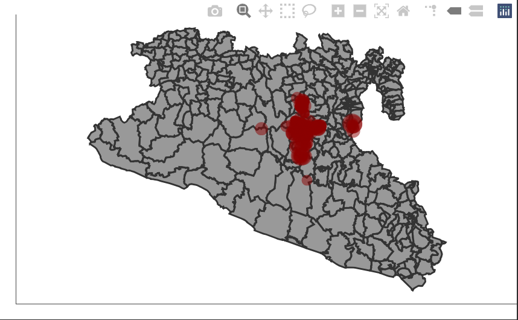

```{r include=FALSE}
knitr::opts_chunk$set(eval = T, message = F, warning = F)
```

# Introduction

Objective:  

In this lab we will focus on reactivity. We will work with messages and buttons to make our app more efficient.

------------------------------

We will continue working in the app we created in previous labs. Now we will focus on improving the user interaction and tools to a better communication between the server and the UI.  
In this lab we will introduce two new libraries: `sf`, for spatial data manipulation; and `plotly`, to make interactive figures.  

```{r Load libraries}
# Load the libraries
library(shiny)
library(dplyr)
library(ggplot2)
library(shinydashboard)
library(STNet)
library(sf) # to manipulate spatial objects
library(plotly) # For interactive plots
```

# Maps

We will introduce a new data set from the STNet library. This new data set is a shape file with the administrative units of Mexico. Since we are only using a small area, we will filter the data set to only include the ones from teh study area.  

```{r Load the data}
# Load the data
data("vac")
data("vigilancia")
data("captura")

# Loading the spatial data from the package
MxShp <- st_read(system.file("data/MxShp.shp", package = "STNet")) %>% 
  filter(CVE_ENT %in% c('15', '12', '16')) # Filter the data to use the states with codes: 15, 12 y 16
```
  
Now we will project the locations from the captures. First we will transform our table of captures to a POINT simple features collection (spatial points) using the function `st_as_sf()`. For this function we specify the coordinate reference system (CRS) and the name of the columns that contains the latitude and longitude (or X and Y).  
Then we use the function `st_transform()` to project our data in the same projection as the data set of locations.  

```{r}
# Convert and project the data
capturaSp <- captura %>% 
  st_as_sf(crs = st_crs(4326), # Coordinate reference system
           coords = c('LONG', 'LATITUD')) %>%  # Name for columns with lat and lon
  st_transform(crs = st_crs(MxShp)) # transform to the MxShp crs
```

## Making the figure

The data for the captures has the number of animals captures and the locations by year. We will make a map that includes the number of animals captured by year and in the background the municipalities of the region.  

```{r}
p <- ggplot() + # we call ggplot
      geom_sf(data = MxShp, fill = 'grey60', col = 'grey20') + # This will be our base map
      geom_sf(data = capturaSp, aes(size = CAPTURADOS), alpha = 0.5, col = 'red4') + # We add the points
      theme_void() # select a theme without the grid

p
```
  
## Incorporating the code in the app. 

### New output in UI

```{r include=FALSE}
knitr::opts_chunk$set(eval = F, message = F, warning = F)
```

We will now create a new box in the tab for the captures data:  

```{r}
tabItem(tabName = 'tab3', # Name we use for the tab
        fluidRow(
          column(width = 12, 
                 # ... , # Here goes the code from the previous figure
                 box(title = 'Capture locations', width = 6,
                     plotOutput('CapturaMap')
                     )
                 )
          )
        )
```

### Modify the reactive event

We can use the same reactive event that we had previously on the bar plot making some modifications in the code. Previously we called the object `capturas` to do the filtering of the data in the reactive event `z()`, but now we can change the object `capturas` for our spatial object we just created `capturasSp` so we can use it to make both the map and the bar plot.  

Our new reactive object will look like this:

```{r}
z <- eventReactive(input$filter, {
    p <- capturaSp %>% # This is the spatial points data we just defined before
      filter(NOM_MUN %in% input$Mun,
             between(YEAR, input$year[1], right = input$year[2])) # here we do the filtering
  })
```


### Incorporating the figure in the server

Now we will create our figure into a new output called 'CapturesMap'  

```{r}
output$CapturesMap <- renderPlot({
    ggplot() +
      geom_sf(data = MxShp, fill = 'grey60', col = 'grey20') +
      geom_sf(data = z(), aes(size = CAPTURADOS), alpha = 0.5, col = 'red4') +
      theme_void()
  })
```


We can run the app to see the changes.  


# Action buttons

The more figures and maps we add to the app, the more resource consuming will be. This is a good moment to talk about action buttons. Action buttons help us to control the reactive processes happening in the server so our app can be more efficient.  
The action buttons are basically inputs, and we use the function `actionButton()` to create them. We will introduce this new input in our menu where we have the rest of the inputs.  

```{r}
sidebar <- dashboardSidebar(
  sidebarMenu(
    # ..., Other elements of the sidebar ...
    actionButton(inputId = 'filter', label = 'Filter data')
    )
  )
```

The action button will be `False` when not activated and will change to `True` when we click on it. We can use this to indicate our app when we want to run the reactive processing. For this we have to change the `reactive()` function for `eventReactive()`. This function will require an argument that specifies when to react to the inputs, so for this we will use the action button we just created.  
Lets make those change in our reactive object `x()`

```{r}
x <- eventReactive(input$filter, {
    p <- vac %>%
      filter(NOM_MUN %in% input$Mun,
             between(YEAR, input$year[1], right = input$year[2])) 
  })
```

## Messages

Another tool we can use to improve the user interaction are messages. For this we can use the reactive function `observeEvent()`.
This function listens to different elements in our app and we can use it to show different messages. In this example, we will use it to indcate when the filtering of the data is completed.  

```{r}
observeEvent(x(), {
    showModal(
      modalDialog("Plots Updated", # Message we want to show
                  easyClose = T) # Option to close the message by clicking anywhere outside the box
      )
  })
```


# Interactive plots.

In this last part of the lab we will introduce to interactive plots wie the `plotly` library.   
This library has its own syntax to make the graphics, but it also has a very convenient function to transform any `ggplot2` figure to an interactive version.  
In the map we previously create, the points are a bit clustered and can be dificult to actually see whats happening, we will use the `ggplotly()` function to convert the figure we previously made into an interactive version of it. This will provide some tools for zooming and paning the figure.

```{r include=FALSE}
knitr::opts_chunk$set(eval = F, message = F, warning = F)
```

```{r}
ggplotly(p) # Function to convert our figure to an interactive version
```



We can integrate our new figure into the app modifying a little bit the code. This new output will be no longer of the type 'plot' so we will need to change the functions for specifying the type of output and rendering it.

## Modifying the output

```{r include=FALSE}
knitr::opts_chunk$set(eval = T, message = F, warning = F)
```

Previously, we used `plotOutput()` to indicate that our output is a plot, now we will change it to `plotlyOutput()` to indicate that is an interactive plot from plotly.  

```{r}
tabItem(tabName = 'tab3',
        fluidRow(
          column(width = 12,
                 # ... , # here is where tour code for the previous figure goes ...
                 box(title = 'Locations of the captures', width = 6,
                     plotlyOutput('CapturesMap')
                     )
                 )
          )
        )
```

## Modifying the render

Now we will change the function `renderPlot()` that we previously used for the function `renderPlotly()` to indicate that we have  a different type of output.  
We will also convert our ggplot figure with the function `ggplotly()`.  

```{r}
output$CapturaMap <- renderPlotly({
    p <- ggplot() +
      geom_sf(data = MxShp, fill = 'grey60', col = 'grey20') +
      geom_sf(data = z(), aes(size = CAPTURADOS), alpha = 0.5, col = 'red4') +
      theme_void()
    
    ggplotly(p)
  })
```


# Exercise.
Try using `ggplotyl()` to change the plots that we previously created into interactive plots. 

