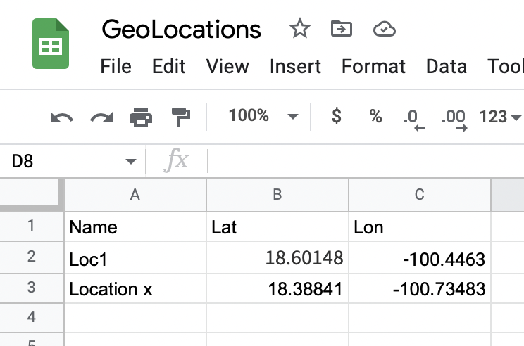
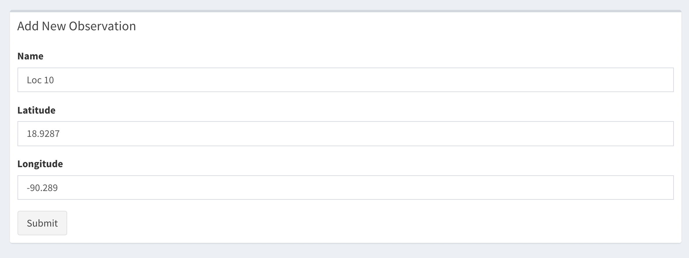
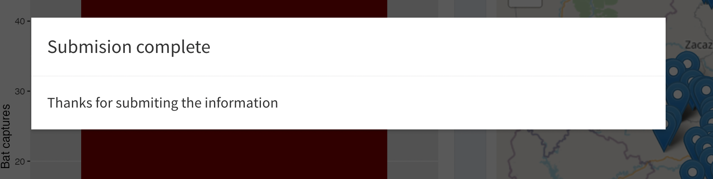

```{r include = F}
knitr::opts_chunk$set(message = F, warning = F, eval = F)
```


# Objective

In this lab we will integrate google sheets to our shiny app. This can be very useful for data collection and real time incorporate new parts of information into our dashboard

------------------------------

#  Google sheets

We will use the packages `googledrive` and `googlesheets4` to save and load daa from google drive

```{r loading packages, message=F}
library(dplyr)
# Install the package if not installed
if(require('googledrive') == F){
 install.packages("googledrive") 
}
if(require('googlesheets4') == F){
 install.packages("googlesheets4") 
}
```

## Authentication
  
There are a couple of things we need to do to authorize R and our shiny app to use google sheets. First we will need to allow the session to catch the authentication information and then use the function `drive_auth()` and `gs4_auth()` to log into our drive. The auth information will be saved in a hidden file called *.secrets*, this file must be saved inside the folder that contains your shiny app.
  
```{r set up drive, eval = F}
# to catch the google drive auth must run this code first: ----------------
# This part creates a folder where the auth info will be stored:
options(
  # whenever there is one account token found, use the cached token
  gargle_oauth_email = TRUE,
  # specify auth tokens should be stored in a hidden directory ".secrets"
  gargle_oauth_cache = "misc/Code/Checkpoints/IIIa/.secrets"
)
# Then you have to authenticate your credentials for both packages:
googledrive::drive_auth() 
googlesheets4::gs4_auth()
# To see the credentials you can use:
list.files("misc/Code/Checkpoints/IIIa/.secrets")
```

Once the authentication is complete, you should see a message like this in your web browser:


## Reading files from your Drive

To read files from the drive, you will need the id of the file you want to access. We can search for files in the drive with the function `drive_find()`, but depending how many files you have, this could take several minutes. If you are trying to access files from a shared drive, you can use the argument `shared_drive` and specify the name.  

```{r eval = F}
drive_find(pattern = 'GeoLocations', shared_drive = 'ShinyWorkshop')$id
```

You can also find the id in the link of the file. For example, for the file we want to access (https://docs.google.com/spreadsheets/d/1ct-_meVE9GsIgTNpQa9n3SJKwXBApKAqdZ539xvSqdY), the id would be the last series of numbers: *1ct-_meVE9GsIgTNpQa9n3SJKwXBApKAqdZ539xvSqdY*
  
To access the file we use the function `read_sheet()` and as argument we specify the id we want to read:
  
```{r reading files}
# define the id for the file:
Geolocations <- '1ct-_meVE9GsIgTNpQa9n3SJKwXBApKAqdZ539xvSqdY'
# Load data
dGL <- read_sheet(ss = Geolocations)

dGL
```


## Writing new entries to the data

We can sue the function `sheet_apend()` to add new rows to our data. Lets create a data.frame that will be a single row, and then append this to the google sheet.

```{r writing files, eval = F}
data.frame(
  Name = 'Location x', # You can try to change the name to something else to see the one you appended
  Lat = 18.38841,
  Lon = -100.73483
  ) %>% 
  sheet_append(ss = Geolocations)
```

If we go to our [google sheet](https://docs.google.com/spreadsheets/d/1ct-_meVE9GsIgTNpQa9n3SJKwXBApKAqdZ539xvSqdY), we will see the new observation we added.  

We can also make the changes directly in the google sheet, and the next time we load the data we will see the changes.  

  

Now that we know how to load and write data to google sheets, lets try to incorporate this in shiny.  

## Incorporating in shiny

### Changes in global.R

It is important that the folder that contains your app has the file we created when authorizing the account, otherwise it will not work when you upload your app to a server, or run it in another session.  
To tell shiny to use the correct auth file you have to add the following code to the global section of your app:

```{r}
# add the libraries we will sue:
library(googledrive)
library(googlesheets4)


# Google drive set up
options(
  # whenever there is one account token found, use the cached token
  gargle_oauth_email = TRUE,
  # specify auth tokens should be stored in the hidden directory ".secrets"
  gargle_oauth_cache = ".secrets"
)
# Specify the id for the file we will use
Geolocations <- '1ct-_meVE9GsIgTNpQa9n3SJKwXBApKAqdZ539xvSqdY'
```

### Changes in ui.R

Now lets create a few inputs so we can add new entries from our shiny app. We will add a new box to our third tab, this box will include the inputs for the columns we want to fill in our data for each row, and we will also create an action button to submit the information.

```{r}
box(title = 'Add New Observation', # title of the new box
    width = 12,
    textInput(inputId = 'NameIn', label = 'Name'), 
    numericInput(inputId = 'LatIn', label = 'Latitude', value = 0),
    numericInput(inputId = 'LonIn', label = 'Longitude', value = 0),
    actionButton(inputId = 'submit', label = 'Submit')
    )
```

You should have a box similar to this one:

  

### Changes in server.R

Now we will do the respective changes in the server to execute the actions. We will use the function `observeEvent()` to react the submit button we created. Every time the button is clicked it will do the following:  
  
  - Open a message box showing the message "Uploading data"
  - Create a data frame with the inputs for Name, Lat and Lon.
  - Append this information to the Google sheet
  - Remove the "Uploading data" message box 
  - Show another message box indicating the submission is completed. 

```{r}
observeEvent(input$submit, {
    showModal(modalDialog("Uploading data", footer=NULL)) #Show first message
    data.frame(Name = input$NameIn, # Create the data frame with the entries
               Lat = input$LatIn,
               Lon = input$LonIn) %>% 
      sheet_append(ss = Geolocations, data = .) # Append the data
    
    removeModal() # Remove first message box
    
    showModal(modalDialog( # Show message of confirmation
      title = "Submision complete",
      paste0('Thanks for submiting the information'),
      easyClose = TRUE,
      footer = NULL
    ))
  })
```

Try to submit an entry and you should get a message like this one:

  

### Exercise

Now try to integrate the locations from the google sheets into the app. The idea would be to first create a reactive object that reads the data from google sheets every time new info is submitted, and then this gets added to the leaflet map.


```{r include=F, eval=F}
# We will add this to the server
dGL <- eventReactive(input$submit, {
    read_sheet(ss = Geolocations) 
  }, ignoreNULL = FALSE)


# To show the markers in the map we can add a line on the previously created leaflet map

output$CapturaMap <- renderLeaflet({
    # Creating a popup
    leaflet() %>% 
      addProviderTiles(providers$OpenStreetMap) %>% 
    ## THIS WILL BE THE NEW LINES ADDING THE GOOGLE SHEETS DATA ##
      addMarkers(data = dGL(), lat = ~Lat, lng = ~Lon,
                 popup = ~paste('<h3>Name:', Name, '</h3>')) %>% 
    ###############################################################
      addMarkers( 
        data = z(),
        clusterOptions = markerClusterOptions(),
        # We can format the popup using some html tags
        popup = ~paste('<h3>Name:', NOM_LOC, '</h3>', 
                       "<br>Captures:", CAPTURADOS,
                       "<br>Location:", REFUGIO_NOM
        ) # The variable we are using for the label
      )
  })
```


[You can download the checkpoint for this lab in this link](https://ucdavis.box.com/s/ky2na35lejjc434943tl77q1oq23lwna)


