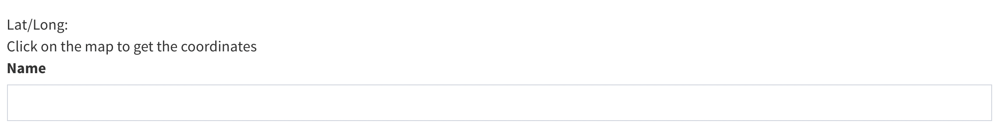
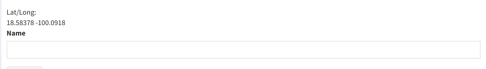

```{r include = F}
knitr::opts_chunk$set(message = F, warning = F, eval = F)
```

# Objective

In this lab we will go over some more advanced methods to allow the user to interact with the maps in our dashboard. 

------------------------------

# More on User Interaction

In this lab we will work mostly in the 

Instead of asking the user to provide the coordinates, we can use the leaflet map we previously created to select the location directly  map. The leaflet Output can send some input events such as the user clicking on a map. We can use this as any other input objects and to refer to it have to any other inputs. For example, if we created the output `leafletOutput('CapturaMap')` we can refer to a position where the user clicks as `input$CapturaMap_click`.  
This will return a list with the coordinates that we can later use.
  
## Changes in ui.R

We will modify our `ui.R` to show the coordinate values with an output instead of an input (as we had it before). We can put this output wherever we want, I will replace the Lat/Lon inputs we previously created with a `textOutput('MapLoc')` that will have the information coming from the leaflet map `CapturaMap`.

```{r}
box(title = 'Add New Observation', # title of the new box
    width = 12,
    textInput(inputId = 'NameIn', label = 'Name'), 
    # numericInput(inputId = 'LatIn', label = 'Latitude', value = 0), # <--- We can delete these inputs now
    # numericInput(inputId = 'LonIn', label = 'Longitude', value = 0),
    textOutput('MapLoc'), #   <---- And use this output to tell us the coordinated selected in the map instead
    actionButton(inputId = 'submit', label = 'Submit')
    )
```

## Changes in server.R

Then we will make some changes in the server to create the `'MapLoc'` output.   

First we will create a new reactive object in our `server.R` file with this information:

```{r}
Loc <- reactive({
    c(
      input$CapturaMap_click[[1]], # Latitude
      input$CapturaMap_click[[2]] # Longitude
      )
  })
```

Using the reactive object `Loc()` we can create the `'MapLoc'` output. We will use an if else statement so when the user will know that have to click on the map to select the location; when the user haven't clicked on the map, the message 'Click on the map to get the coordinates' will be shown; otherwise the coordinates where the user clicked will be shown

```{r}
output$MapLoc <- renderText({
    if(is.null(input$CapturaMap_click)){  # Show a message when the object input$CapturaMap_click is null 
      'Click on the map to get the coordinates'
    }else{
      Loc() # Show the coordinates otherwise
    }
  })
```

Before clicking on the map, the user should see this:  

  
  
After clicking on the map, the user should see the coordinates:  

  


Now the inputs `input$LatIn` and `input$LonIn` no longer exist in our app, so we will have to replace them with `Loc()[1]` and `Loc()[2]` wherever we had it in the code. We were using the inputs `LatIn` and `LonIn` to write the information to the google sheet, so we will change that part of the code and will look like this instead:

```{r}
# Remember this part is in our server.R under an observeEvent
# Save the data
    data.frame(Name = input$NameIn,
               Lat = Loc()[1],
               Lon = Loc()[2]) %>% 
      sheet_append(ss = Geolocations, data = .)
```


# Few more features of leaflet

To finish this workshop we will just mention a few more features from leaflet that can help with the user experience for our dashboards


```{r}
# Load libraries
library(dplyr)
library(sf)
library(STNet)

# Load data
data("vac") # Data for vaccination
data("vigilancia") # Data for surveillance
data("captura")

# Loading the spatial data from the package
MxShp <- st_read(system.file("data/MxShp.shp", package = "STNet")) %>% 
  filter(CVE_ENT %in% c('15', '12', '16')) %>%  # Filter the data to use the states with codes: 15, 12 y 16
  st_transform(crs = st_crs(4326)) # transform to lat/long
```

Lets create a base leaflet map and save it in an object:

```{r}
map <- leaflet() %>% 
  addProviderTiles(providers$OpenStreetMap) %>% 
  addMarkers(
    data = capturaSp,
    # We can format the popup using some html tags
    popup = ~paste('Name:', NOM_LOC, 
                   "<br>Captures:", CAPTURADOS) # The variable we are using for the label
    )
```


## Measurement

You can add a measurement tool with the function `addMeasure()`. This will allow the user to measure distance between points and areas. You should seee the measurement tool in the top right corner

```{r}
map %>% 
  addMeasure()
```


## Inset maps

```{r}
map %>% 
  addMiniMap()
```

You can also change the base map for the inset mini maps and add other options.

```{r}
map %>% 
  addMiniMap(tiles = providers$OpenTopoMap,
             toggleDisplay = T)
```

## Adding multiple layers

We can add multiple layers and a menu to change between them, to do this we will first get all the layers from ESRI and then add them to the map with an option to change between layers.

```{r}
# get all the provider names with ESRI on the text
esri <- grep("^Esri", providers, value = TRUE) 

# add all the providers to the map
for (provider in esri) {
  map <- map %>% addProviderTiles(provider, group = provider)
}

# Map the layers with the options to switch between layers
map %>%
  addLayersControl(baseGroups = names(esri),
    options = layersControlOptions(collapsed = FALSE)) %>%
  addMiniMap(tiles = esri[[1]], toggleDisplay = TRUE,
    position = "bottomleft")
```


[You can download the checkpoint for this lab in this link](https://ucdavis.box.com/s/e8g3wilaksydnaprpzbc5sje4r0wvgik)


